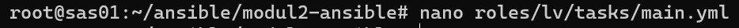

## Laporan Hasil Pratikum 2 - Sistem Administrasi Server 

Nadila Chusnul K - 1202190020 \
Anastasya Rahma Juniarti - 120219058\
Kelompok 10 

Langkah pertama yang akan dilakukan pastikan pengaturan adapter “bridge”. Masuk ansible modul 2

```bash
   cd ~/ansible/modul2-ansible
 ```
 

 Tambahkan “bind9” dan “dnsutils” di roles/php/tasks/main.yml
```bash
   nano roles/php/tasks/main.yml
 ```


Tambahkan perintah di roles/lv/tasks/main.yml

```bash
   nano roles/lv/tasks/main.yml
 ```
 
 
 

Tambahkan restart bind di roles/lv/handlers/main.yml

```bash
   nano  roles/lv/handlers/main.yml
 ```


kemudian run ansible 

```bash
  ansible-playbook -i install-laravel.yml -k 
 ```


Cek apakah sudah benar tercopy file “named.conf.local”, “vm.local”, “1.168.192.in-addr.arpa”, “named.conf.options”, dan “resolv.conf” pada direktory roles/lv/templates

```bash
 nano roles/lv/templates/names.conf.local 
 ```


```bash
 nano roles/lv/templates/vm.local 
 ```


```bash
 nano roles/lv/templates/1.168.192.in-addr.arpa
 ```


```bash
 nano roles/lv/templates/named.conf.options
 ```


```bash
 nano roles/lv/templates/resolv.conf
 ```


Tambahkan “dev.vm.local” pada /etc/hosts

```bash
 nano /etc/hosts
 ```


Masuk pada ubuntu landing 

```bash
 lxc-attach ubuntu_landing
 ```


enter nano vm.local, then add 'www IN CNAME vm.local.'

```bash
 nano /var www IN CNAME vm.local 
 ```
 


Restart lalu exit lxc


Run ansible playbook 

```bash
ansible-playbook -i hosts install-laravel.yml -k
```


Test di browser
```bash
dev.vm.local
```
